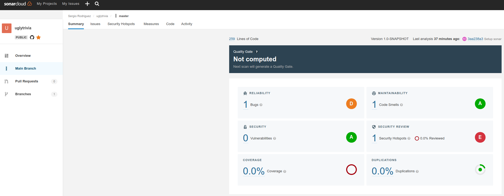
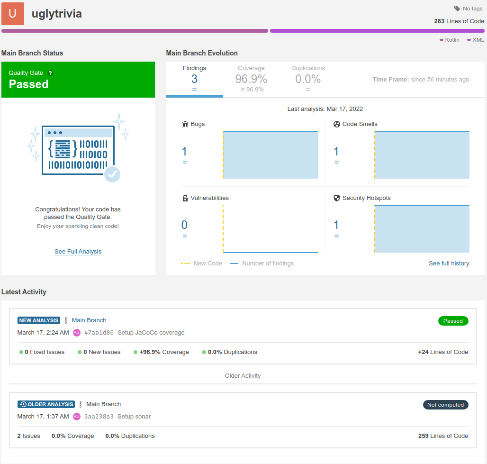
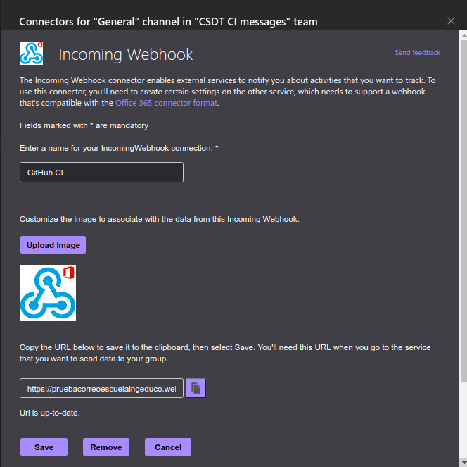
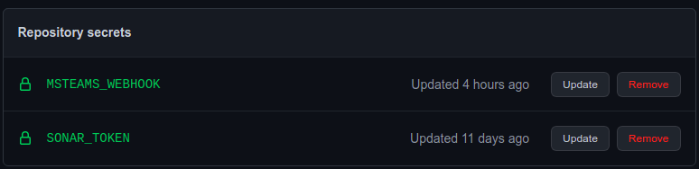
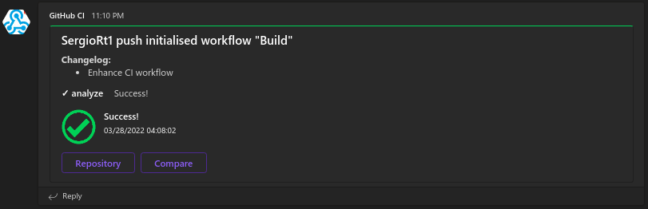
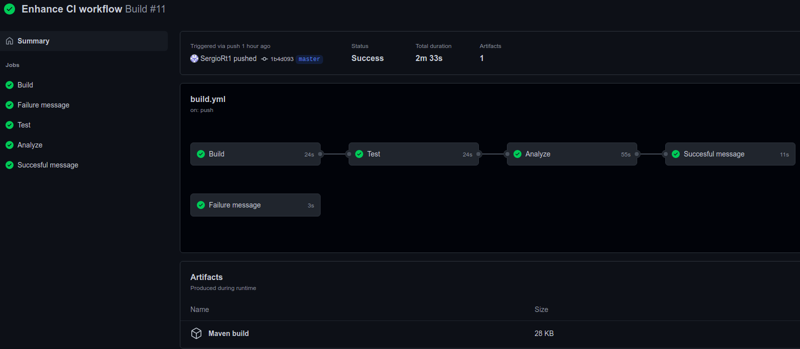

# BugsZero Kata

### Escuela colombiana de ingeniería Julio Garavito

### CSDT

## Proyecto

* Idioma seleccionado: **Kotlin**

**Temas:**

* Revisión preliminar
* Análisis del código
* Análisis deuda técnica en las Pruebas
* CI y herramientas de análisis de calidad

---

## Integración CI con GitHub Actions

### SonarCloud

Para configurar SonarCloud debemos conceder permisos para acceder al repositorio Git, luego establecer en el repositorio
un _secret_ en la configuración de GitHub Actions con el token de Sonar, por último debemos agregar el archivo de
[build.yml](.github/workflows/build.yml) para el pipeline en Github Actions y agregar las properties de sonar a la de
Maven en el [pom.xml](kotlin/pom.xml).

Estos cambios se pueden ver en el
commit [3aa238a](https://github.com/SergioRt1/BugsZero-Kata/commit/3aa238a3710a7dfe305d479010f3de8403a349cd).

### Cobertura con JaCoCo

La cobertura de código es el porcentaje de código que está cubierto por pruebas automatizadas. La medición de cobertura
de código determina declaraciones en el código se han ejecutado a través de la ejecución de pruebas y qué declaraciones
no.

SonarCloud nos permite llevar un historial de las métricas de calidad del código de nuestro proyecto, pero no se encarga
de hacer el análisis de cobertura, usa el informe generado por herramientas externas para seguir la cobertura.

En este caso se usará [JaCoCo](https://github.com/jacoco/jacoco), una de las herramientas más populares para realizar el
análisis de cobertura en la JVM, el proceso para configurar la herramienta se puede encontrar en
la [documentación](https://docs.sonarcloud.io/enriching/test-coverage/java-test-coverage/), modificamos
el [pom.xml](kotlin/pom.xml) para incluir el plugin de JaCoCo, estos cambios lo podemos ver en el
commit [47ab1d8](https://github.com/SergioRt1/BugsZero-Kata/commit/47ab1d86c98062929db639ee6285a6897b3de69b).

### Custom steps en GitHub workflow

Podemos separar en diferentes pasos el build, los tests, el análisis estático de código y agregar pasos extra cómo
enviar notificaciones a servicios externos con el resultado de la ejecución del workflow, para eso debemos modificar el
archivo [build.yml](.github/workflows/build.yml) en `.github/workflows` que especifica el funcionamiento de nuestro
workflow, podemos crear varios _Jobs_ cada uno para cada una de las etapas del flujo, para detalles de GitHub Actions
acá está la [documentación](https://docs.github.com/es/actions).

* Build: El primer paso será construir el proyecto compilando de los archivos fuentes y lo exportaremos en un nuevo
  artefacto llamado _Maven build_ estos fuentes se encuentran en `./kotlin/target/` para evitar correr los tests
  usaremos el parámetro `-DskipTests` del plugin `Maven Surefire` que nos permite aislar ambos procesos, no es necesario
  agregar la dependencia debido a que el plugin de JaCoCo ya la importa, el comando sería: `mvn install -DskipTests`
* Test: Luego importaremos los binarios previamente compilados y correremos las pruebas unitarias de forma aislada, para
  ellos usaremos nuevamente el plugin `Maven Surefire` con el comando `mvn surefire:test`
* Análisis: después realizaremos el análisis estático de código con SonarCloud previamente configurado
* Teams messages: Por último, enviaremos un mensaje a _Microsoft Teams_ con el estado de la ejecución del pipeline, para
  ello usaremos la acción [notify-microsoft-teams](https://github.com/marketplace/actions/notify-microsoft-teams)
  Para poder conectar con Teams debemos crear un _Incoming Webhook_ en el _team_ que deseemos agregar el bot con el
  mensaje acá está
  la [documentación](https://docs.microsoft.com/en-us/microsoftteams/platform/webhooks-and-connectors/how-to/add-incoming-webhook)
  para crear el _Incoming Webhook_.

  

  Una vez creado tendremos la URL la cual debemos agregar como secret en el proyecto de GitHub.

  

  El mensaje resultado puede ser exitoso o fallido, crearemos un Job para cada caso, para el caso exitoso dejaremos sin
  condición la acción pero como prerrequisito del paso _Analyze_ y el caso fallido no tendrá otro Job como prerrequisito
  pero solo se ejecutara si el workflow falla.

  

El [flujo](https://github.com/SergioRt1/BugsZero-Kata/actions/runs/2050089763) completo se vería de la siguiente forma:

## Autor

* **[Sergio Rodríguez](https://github.com/SergioRt1)**

## License

This project is license under the Apache-2.0 License - see the [LICENSE](LICENSE) file for more details.
