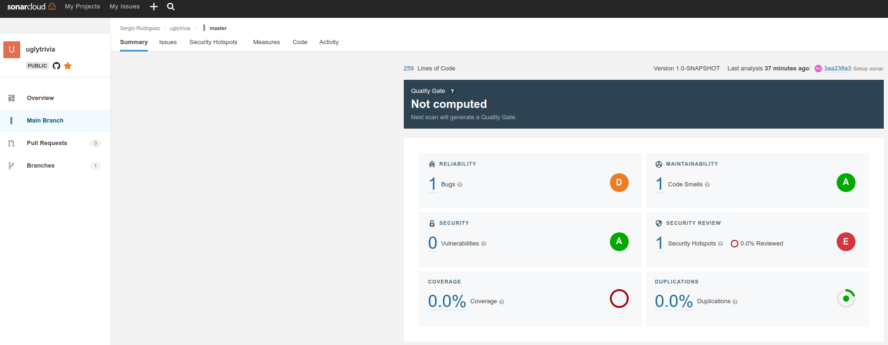
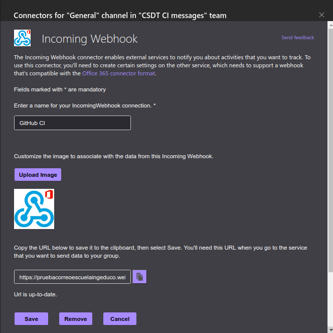
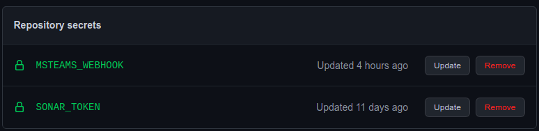
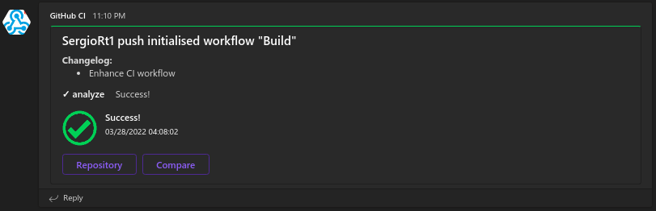
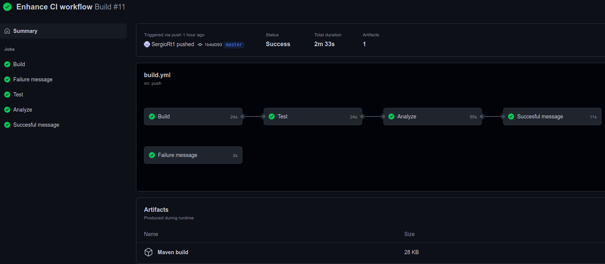

# BugsZero Kata

### Escuela colombiana de ingeniería Julio Garavito

### CSDT

## Proyecto

* Idioma seleccionado: **Kotlin**

### **Temas:**

* [Revisión preliminar](https://github.com/SergioRt1/BugsZero-Kata/blob/master/CSDT.md#revisión-preliminar)
* [Análisis del código](https://github.com/SergioRt1/BugsZero-Kata/blob/master/CSDT.md#análisis-del-código)
* [Análisis deuda técnica en las Pruebas](https://github.com/SergioRt1/BugsZero-Kata/blob/master/CSDT.md#análisis-deuda-técnica-en-las-pruebas)
* [CI y herramientas de análisis de calidad](https://github.com/SergioRt1/BugsZero-Kata/blob/master/CSDT.md#ci-y-herramientas-de-análisis-de-calidad)
* [Deuda en la arquitectura](https://github.com/SergioRt1/BugsZero-Kata/blob/master/CSDT.md#deuda-en-la-arquitectura)
* [ATAM + QAW](https://github.com/SergioRt1/BugsZero-Kata/blob/master/CSDT.md#análisis-de-atributos-de-calidad-en-la-arquitectura)

---

## Revisión preliminar

Cuando pensamos en realizar una revisión sobre la calidad del software, la primera idea es revisar el proyecto el código fuente
e intentar detectar algún defecto o algo extraño en el código fuente, pero terminamos en una búsqueda poco estructurada y sin
objetivos claros por lo que puede que pasemos muchas cosas por alto. Aun así, me es interesante realizar el ejercicio para luego
contrastar los resultados con las otras estrategias.

### Code smells y problemas detectados

* __Código duplicado:__ En varios métodos se repite código como:
  ``` kotlin
  if (currentPlayer == players.size) currentPlayer = 0
  ``` 
* __Código dificil de probar:__ Es difícil de aislar las pruebas validando una sola funcionalidad, la UI y la lógica están mezcladas,
y hay métodos que realizan más de una funcionalidad y llaman a otros métodos privados que son difíciles de probar de forma individual,
como `roll` llama `movePlayerAndAskQuestion` que a su ves llama a `askQuestion` que llama a `currentCategory`.

* Acceso a indices de arreglos sin validar, generando posibles _Index out of bounds exception_.
  ``` kotlin
  fun MutableList<String>.removeFirst(): String {
    return this.removeAt(0)
  }
  ```
* Variables definidas como mutables cuando pueden ser inmutables `val` y definirse en el constructor. El constructor no se usa para
inicializar los parámetros de la clase, se usan los valores default y se dejan literales mágicos en el código

  ``` kotlin
  var players = mutableListOf<String>()
  var places = IntArray(6)
  var purses = IntArray(6)
  var inPenaltyBox = BooleanArray(6)
  ```
  
* Acoplamiento de la cantidad de jugadores: Del bloque de código anterior se ve que el número máximo de jugadores está explícito en el código
(6) como un literal sin valor semántico, estas variables se pueden inicializar en el constructor para darle más flexibilidad.
* Hay poca cohesión entre la lógica y los datos

### Técnicas de refactor identificadas

* Extract Method
* Extract variable
* Encapsulate Record
* Change Function Declaration
* Inline Function
* Replace Magic Literal
* Remove Flag Argument

---

## Análisis del código

### Características Clean code

* __Código enfocado:__ No hay métodos excesivamente largos, sin embargo, se puede mejorar hay métodos tiene varias responsabilidades,
por ejemplo,  [movePlayerAndAskQuestion](kotlin/src/main/kotlin/com/adaptionsoft/games/uglytrivia/Game.kt) hace dos cosas
  mueve al jugador y realiza una pregunta, esto se puede separar.
  ``` kotlin
  private fun movePlayerAndAskQuestion(roll: Int) {
    places[currentPlayer] = places[currentPlayer] + roll
    if (places[currentPlayer] > 11) places[currentPlayer] = places[currentPlayer] - 12

    println(players.get(currentPlayer)
            + "'s new location is "
            + places[currentPlayer])
    println("The category is " + currentCategory())
    askQuestion()
  }
  ```

* __Regla del Boy Scout:__ : Esta característica aplica en el historial de Git se observan cambios al código fuente
y la documentación, correcciones de bugs y actualización de librerías ejemplo: `9dd55ac2`

* __Entendible:__ Esta característica se cumple en su mayoría, los nombres de variables y métodos tiene un sentido
semántico, pero hay algunas literales mágicos como
  ``` kotlin
  private fun didPlayerWin(): Boolean {
    return purses[currentPlayer] != 6
  }
  ```

* __Escalable:__ La aplicación no es muy escalable, por ejemplo, agregar la funcionalidad para jugar de a más de
dos jugadores requiere realizar múltiples cambios porque parte de la lógica está acoplada a 6 jugadores
   ``` kotlin
   var inPenaltyBox = BooleanArray(6)
   ```
  Además hay muchas variables explicitas y codigo que se puede refactorizar siguendo los principios SOLID.
* __Duplicidad:__ Hay segmentos de código que se repiten en multiples métodos como:
  ``` kotlin
  if (currentPlayer == players.size) currentPlayer = 0
  ``` 
* __Abstracción:__ Se puede mejorar la abstracción hay métodos que hacen más de una cosa y la lógica y la capa
de vista que interactúa con el usuario están muy acopladas, si se desea cambiar la UI no se puede reusar la logia del juego.
  ``` kotlin
  fun add(playerName: String): Boolean {
    players.add(playerName)
    places[howManyPlayers()] = 0
    purses[howManyPlayers()] = 0
    inPenaltyBox[howManyPlayers()] = false

    println(playerName + " was added")
    println("They are player number " + players.size)
    return true
  }
  ```
* __Testeable:__  No es sencillo de testiear, al menos con pruebas unitarias aisladas que validen cada método.
* __Principio menor asombro:__ Este principio se cumple los métodos hacen los su nombre índica.

### Principios de programación

* __YAGNI:__ Este principio se cumple, no hay funcionalidades o métodos sin usar.
* __KISS:__ El proyecto es corto y por ende tiene poca complejidad, sin embargo, hay métodos innecesarios como:
  ``` kotlin
  fun MutableList<String>.addLast(element: String) {
    this.add(element)
  }
  ```

* __DRY:__ Hay segmentos de código repetidos en varias partes del código como:
  ``` kotlin
  if (currentPlayer == players.size) currentPlayer = 0
  ``` 
* __SOLID:__ se pueden aplicar varias mejoras siguiendo los principios SOLID, como ya se ha mencionado anteriormente,
por ejemplo, refactorizar lo acoplado que se encuentra que el juego solo sea para dos jugadores o como la UI y la lógica
están juntas permitiría mejorar el principio Open/Close.

### Practicas XP

Podrían utilizarse:

* __Refactoring:__ Se pueden aplicar técnicas de refactoring para extraer variables, métodos, darle significado semántico
a algunos literales mágicos.
  ``` kotlin
  private fun currentCategory(): String {
    if (places[currentPlayer] == 0) return "Pop"
    if (places[currentPlayer] == 4) return "Pop"
    if (places[currentPlayer] == 8) return "Pop"
    if (places[currentPlayer] == 1) return "Science"
    if (places[currentPlayer] == 5) return "Science"
    if (places[currentPlayer] == 9) return "Science"
    if (places[currentPlayer] == 2) return "Sports"
    if (places[currentPlayer] == 6) return "Sports"
    return if (places[currentPlayer] == 10) "Sports" else "Rock"
  }
  ``` 
  Además la logica y capa de la vista que interactúa con el usuario están muy acopladas.

* __Continuous integration:__ El proyecto no cuenta con CI.
* __Simple design:__ Se puede refactorizar la app, en un diseño más sencillo menos acoplado y extensible.
* __Test-driven development:__ Se puede aplicar esta práctica para construir una aplicación fácil de testear y menos
  acoplada.

---

## Análisis deuda técnica en las Pruebas

### Prácticas de Testing debt

* No hay pruebas unitarias, hay una sola prueba en el proyecto y válida toda la funcionalidad en diversos casos, se
podría considerar pruebas de usuario final. Las pruebas están muy acopladas al estado actual del proyecto,
si se agregan nuevas funcionalidades se debería cambiar el archivo
[GameTest.itsLockedDown.approved.txt](kotlin/src/test/kotlin/com/adaptionsoft/games/trivia/GameRunnerTest.itsLockedDown.approved.txt)
  que contiene todos los escenarios que son válidos.
* Promover un cubrimiento alto: Las pruebas cubren casi todo el código (96% de las líneas), el único método que no se prueba es:
  es:
  ```kotlin
    val isPlayable: Boolean
        get() = howManyPlayers() >= 2
  ```
  porque es un método que no se usa, aun así se podría realizar una prueba unitaria para validar su funcionamiento.
* No se usa el patrón AAA
* No se cumple _Divide y vencerás, las pruebas se componen de múltiples escenarios que se corren en una única
   [prueba](kotlin/src/test/kotlin/com/adaptionsoft/games/trivia/GameTest.kt).
* **Utilice estándares de nombramiento y prácticas de Clean Code:** El nombre de la única prueba es itsLockedDown el cual
no es muy semántico de lo que se desea validar.
* **Nuevos defectos nuevas pruebas unitarias**: Como está si se detecta un defecto se modificaría el archivo 
[GameTest.itsLockedDown.approved.txt](kotlin/src/test/kotlin/com/adaptionsoft/games/trivia/GameRunnerTest.itsLockedDown.approved.txt)
 que contiene los resultados esperados, no se realizaría una nueva prueba unitaria.

## Pruebas unitarias

Se Agregaron nuevas pruebas unitarias para la clase `Game` en el
archivo [GameTest.kt](kotlin/src/test/kotlin/com/adaptionsoft/games/ugltrivia/GameTest.kt) que se encuentra en el mismo
paquete de la clase aprobar y se renombró el test original
a [GameRunnerTest](kotlin/src/test/kotlin/com/adaptionsoft/games/trivia/GameRunnerTest.kt)

Para garantizar que no hayan dependencias entre pruebas se agregaron bloques `@Before` y `@After` para limpiar la
ejecución de cada caso.

```kotlin
private lateinit var out: PrintStream

@Before
fun setUp() {
    out = System.out
}

@After
fun tearDown() {
    System.setOut(out)
}
```

Cada prueba tiene el buffer de salida default, por lo que, si se valida el output sobrescribiendo el buffer
no va a afectar a otras pruebas, esto es útil para pruebas como  `roll message should work` y `add player message should work`
entre otras que validan el output de la consola.

## Sugerencias

* Se debería refactorizar el código para reducir las dependencias entre métodos, por ejemplo hay métodos que realizan
  multiples acciones y llaman a otros métodos privados que son difíciles de probar de forma individual, como `roll`
  llama `movePlayerAndAskQuestion` que a su ves llama a `askQuestion` que llama a `currentCategory`.
* Separar la capa de UI y de lógica, se deben hacer pruebas que cubran ambas funcionalidades sobre el mismo método, por
  ejemplo las pruebas `add player message should work` y `add player should work`, este acoplamiento dificulta las
  pruebas y la extensibilidad de la aplicación.

---

## CI y herramientas de análisis de calidad

### SonarCloud

Para configurar SonarCloud debemos conceder permisos para acceder al repositorio Git, luego establecer en el repositorio
un _secret_ en la configuración de GitHub Actions con el token de Sonar, por último debemos agregar el archivo de
[build.yml](.github/workflows/build.yml) para el pipeline en Github Actions y agregar las properties de sonar a la de
Maven en el [pom.xml](kotlin/pom.xml).

Estos cambios se pueden ver en el
commit [3aa238a](https://github.com/SergioRt1/BugsZero-Kata/commit/3aa238a3710a7dfe305d479010f3de8403a349cd).



### Cobertura con JaCoCo

La cobertura de código es el porcentaje de código que está cubierto por pruebas automatizadas. La medición de cobertura
de código determina declaraciones en el código se han ejecutado a través de la ejecución de pruebas y qué declaraciones
no.

SonarCloud nos permite llevar un historial de las métricas de calidad del código de nuestro proyecto, pero no se encarga
de hacer el análisis de cobertura, usa el informe generado por herramientas externas para seguir la cobertura.

En este caso se usará [JaCoCo](https://github.com/jacoco/jacoco), una de las herramientas más populares para realizar el
análisis de cobertura en la JVM, el proceso para configurar la herramienta se puede encontrar en
la [documentación](https://docs.sonarcloud.io/enriching/test-coverage/java-test-coverage/), modificamos
el [pom.xml](kotlin/pom.xml) para incluir el plugin de JaCoCo, estos cambios lo podemos ver en el
commit [47ab1d8](https://github.com/SergioRt1/BugsZero-Kata/commit/47ab1d86c98062929db639ee6285a6897b3de69b).


### SonarLint

SonarLint es una herramienta que permite realizar análisis de código de forma local en el IDE para identificar y
corregir problemas de calidad y seguridad en el código de forma temprana.

Para instalar la herramienta solo debemos ir al IDE y agregar el _plugin_


En la nueva pestaña de SonarLint podemos correr un análisis sobre el proyecto para identificar los problemas de forma
local, estos errores son lso mismos que vemos en SonarCloud.


### Custom steps en GitHub workflow

Podemos separar en diferentes pasos el build, los tests, el análisis estático de código y agregar pasos extra cómo
enviar notificaciones a servicios externos con el resultado de la ejecución del workflow, para eso debemos modificar el
archivo [build.yml](.github/workflows/build.yml) en `.github/workflows` que especifica el funcionamiento de nuestro
workflow, podemos crear varios _Jobs_ cada uno para cada una de las etapas del flujo, para detalles de GitHub Actions
acá está la [documentación](https://docs.github.com/es/actions).

* Build: El primer paso será construir el proyecto compilando de los archivos fuentes y lo exportaremos en un nuevo
  artefacto llamado _Maven build_ estos fuentes se encuentran en `./kotlin/target/` para evitar correr los tests
  usaremos el parámetro `-DskipTests` del plugin `Maven Surefire` que nos permite aislar ambos procesos, no es necesario
  agregar la dependencia debido a que el plugin de JaCoCo ya la importa, el comando sería: `mvn install -DskipTests`
* Test: Luego importaremos los binarios previamente compilados y correremos las pruebas unitarias de forma aislada, para
  ellos usaremos nuevamente el plugin `Maven Surefire` con el comando `mvn surefire:test`
* Análisis: después realizaremos el análisis estático de código con SonarCloud previamente configurado
* Teams messages: Por último, enviaremos un mensaje a _Microsoft Teams_ con el estado de la ejecución del pipeline, para
  ello usaremos la acción [notify-microsoft-teams](https://github.com/marketplace/actions/notify-microsoft-teams)
  Para poder conectar con Teams debemos crear un _Incoming Webhook_ en el _team_ que deseemos agregar el bot con el
  mensaje acá está
  la [documentación](https://docs.microsoft.com/en-us/microsoftteams/platform/webhooks-and-connectors/how-to/add-incoming-webhook)
  para crear el _Incoming Webhook_.

  

  Una vez creado tendremos la URL la cual debemos agregar como secret en el proyecto de GitHub.

  

  El mensaje resultado puede ser exitoso o fallido, crearemos un Job para cada caso, para el caso exitoso dejaremos sin
  condición la acción pero como prerrequisito del paso _Analyze_ y el caso fallido no tendrá otro Job como prerrequisito
  pero solo se ejecutara si el workflow falla.

  

El [flujo](https://github.com/SergioRt1/BugsZero-Kata/actions/runs/2050089763) completo se vería de la siguiente forma:



### Análisis del proyecto

Con las herramientas de análisis de código podemos detectar algunos problemas y llevar trazabilidad de la evolución del
proyecto, la cobertura de los test (97%~) es amplia debido a
los [test](kotlin/src/test/kotlin/com/adaptionsoft/games/ugltrivia/GameTest.kt) unitarios agregados, además el proyecto
no es muy extenso y no hay demasiados problemas que sean evidentes.  

---

## Deuda en la arquitectura

Para identificar las causas de los problemas de arquitectura que puedan haber en el proyecto es necesario preguntarnos
¿Quién es el equipo en involucrado? En este caso el proyecto es un Dojo de aprendizaje con algunos errores hechos a
propósito, por lo que podemos suponer que la mayoría de la deuda en la arquitectura es intencional.

El proyecto en sí tiene una funcionalidad sencilla por lo que no hay muchos drivers y restricciones de negocio, por lo
cual vamos a centrarlos en los problemas de arquitectura que se puedan identificar analizando el código.

* **Dependencias externas sin soporte:**
  Haciendo uso de herramientas de análisis de código como [Sonarlint](CSDT_PrimeraEntrega2022.md) configurado
  previamente, podemos identificar Architectural Smells en el archivo [pom.xml](kotlin/pom.xml), con una de las
  dependencias usadas en el proyecto _ApprovalTests_, la cual no se importa de Maven central u otro repositorio
  unificado dependencias, sino que el archivo [Jar](kotlin/src/main/lib/ApprovalTests.jar) se encuentra directamente en
  el proyecto y esto compromete la portabilidad del proyecto y es una
  dependencia [inestable](https://www.tusharma.in/smells/AUD.html).

  

* **Obsolescencia tecnológica:**
  Una de los cambios necesarios para poder correr el proyecto actualizar la version de Kotlin, ya que versiones menores
  a la 1.3 no son compatibles con el JDK 11, ni la última versión del plugin de compatibilidad Kotlin-JVM. La mayoría de
  librerías que se encontraban originalmente en el proyecto están desactualizadas, por
  ejemplo [JUnit 4.8.2](https://mvnrepository.com/artifact/junit/junit/4.8.2), tiene fecha lanzamiento octubre del 2010
  y presenta algunas vulnerabilidades de
  seguridad [CVE-2020-15250](https://cve.mitre.org/cgi-bin/cvename.cgi?name=CVE-2020-15250).

  Otro caso es _ApprovalTests_ de la cual no se sabe exactamente que versión se usa en el pom.xml indica la versión
  0.17, en [Maven central](https://mvnrepository.com/artifact/com.approvaltests/approvaltests) la versión actual es la
  15.0.0 la más antigua es la [2.0.0](https://mvnrepository.com/artifact/com.approvaltests/approvaltests/2.0.0) de 2018,
  que cuenta con multiples vulnerabilidades de seguridad
  como: [CVE-2022-23305](https://cve.mitre.org/cgi-bin/cvename.cgi?name=CVE-2022-23305),
  [CVE-2022-23302](https://cve.mitre.org/cgi-bin/cvename.cgi?name=CVE-2022-23302) entre otras.

* **Problemas explicitos en el código:**
  En el compone de código que se encarga de la lógica del proyecto también podemos encontrar deuda técnica en
  arquitectura, algunos de estos puntos se explican previamente en más detalle
  en [secciones](CSDT_PrimeraEntrega2022.md) anteriores, pero por ejemplo el uso de constantes mágicas y los problemas
  de acoplamiento de la cantidad de jugadores en el juego, afectan el atributo de calidad de modificabilidad del
  proyecto.

  El proyecto no cuenta con capas que podrían separa la vista (UI) y la lógica, están integrados los _prints_ en los
  métodos del funcionamiento del juego [No layer](https://www.tusharma.in/smells/NL.html).

* **Diseños no actualizados o no existentes:**
  No existe diseños ni documentación de la arquitectura del proyecto, para trabajar de forma efectiva como un equipo es
  necesario ser capaz de expresar el funcionamiento de la arquitectura de forma rápida entre el equipo, en esto juega un
  rol importante los diagramas y otras forma de documentación, que nos permiten visualizar y documentar los artefactos y
  sus interacciones en un sistema de software, facilitando así la comunicación de ideas.
  
---

## Análisis de atributos de calidad en la arquitectura

Al momento de plantarnos una arquitectura compleja es necesario analizar los atributos de calidad del sistema y
priorizarlos, debido a que nos encontraremos con escenarios en los que debemos realizar concesiones entre estos
atributos para priorizar algunos sobre otros. A continuación plantearemos dos escenarios qué buscan poner a prueba
nuestras decisiones de arquitectura para validar si se cumple la prioridad que le dimos a los atributos de calidad y
plantearnos posibles mejoras o modificaciones a la arquitectura qué nos permitan satisfacer los escenarios planteados.

### Refinamiento de escenarios

Debido al reducido el tamaño del proyecto sobre el cual se está realizando el análisis, se plantearon los escenarios
pensando en cuáles son los atributos de calidad qué son se peden ver afectados por el artefacto del que disponemos (el
código fuente) y serian relevantes para el owner del producto.

|  | **Scenario Refinement for Scenario 1**                                                                                                                     |
|----------------------------------------|----------------------------------------------------------------------------------------------------------------------|
| **Scenario(s):**                       | Cuándo se decide agregar la capacidad al juego para poder jugar con un número arbitrario de jugadores                |
| **Business Goals:**                    | Nueva característica                                                                                                 |
| **Relevant Quality Attributes:**       | Modificabilidad                                                                                                      |
| **Stimulus:**                          | Se determinó que los usuarios del producto desean a jugar con más de 6 jugadores                                     |
| **Stimulus Source:**                   | Feedback provisto por los usuarios a través de encuestas, valoraciones en linea o sugerencias                        |
| **Environment:**                       | El producto es exitoso y se detecta la necesidad de nuevas características                                           |
| **Artifact (If Known):**               | Código fuente                                                                                                        |
| **Response:**                          | Es posible jugar con cualquier número de jugadores                                                                   |
| **Response Measure:**                  | Tiempo qué se demora en salir el feature a producción y esfuerzo medido en puntos de historia para realizar la tarea |
| **Questions:**                         | Cuánto esfuerzo nos costaría desarrollar esta característica                                                         |
| **Issues:**                            | Puede ser necesario refactorizar y realizar modificaciones en el código para poder tener esta característica         |

Este primer escenario planteó porque se detectó en el código que había cierto acoplamiento que impedía la 
modificabilidad de la cantidad de jugadores que pueden jugar el juego.

|  | **Scenario Refinement for Scenario 2**                                                                                                                               |
|----------------------------------------|----------------------------------------------------------------------------------------------------------------------------------------------------------------------|
| **Scenario(s):**                       | Se desea expandir el mercado del juego haciéndolo disponible en múltiples plataformas con diferentes sistemas operativos                                             |
| **Business Goals:**                    | Expansión del producto                                                                                                                                               |
| **Relevant Quality Attributes:**       | Portabilidad                                                                                                                                                         |
| **Stimulus:**                          | El producto es exitoso y se desea expandir a nuevas plataformas                                                                                                      |
| **Stimulus Source:**                   | Estadísticas de consumo del producto                                                                                                                                 |
| **Environment:**                       | El producto está rindiendo satisfactoriamente en la plataforma actual                                                                                                |
| **Artifact (If Known):**               | Código fuente                                                                                                                                                        |
| **Response:**                          | El producto funciona sin problemas en todas las plataformas deseadas                                                                                                 |
| **Response Measure:**                  | Número de plataformas en las que función correctamente                                                                                                               |
| **Questions:**                         | Cuál sería el número mínimo adecuado de plataformas en las que debería funcionar el producto y cuales serían las plataformas a las que se desea expandir el producto |
| **Issues:**                            | Durante el desarrollo del componente de software es necesario garantizar la portabilidad del sistema                                                                 |

El segundo escenario se planteó porque identificó que se importa una librería de
pruebas ([ApprovalTests](kotlin/src/main/lib/ApprovalTests.jar)) de forma inadecuada lo cual afecta significativamente
la portabilidad del sistema.

## Autor

* **[Sergio Rodríguez](https://github.com/SergioRt1)**

## License

This project is license under the Apache-2.0 License - see the [LICENSE](LICENSE) file for more details.
