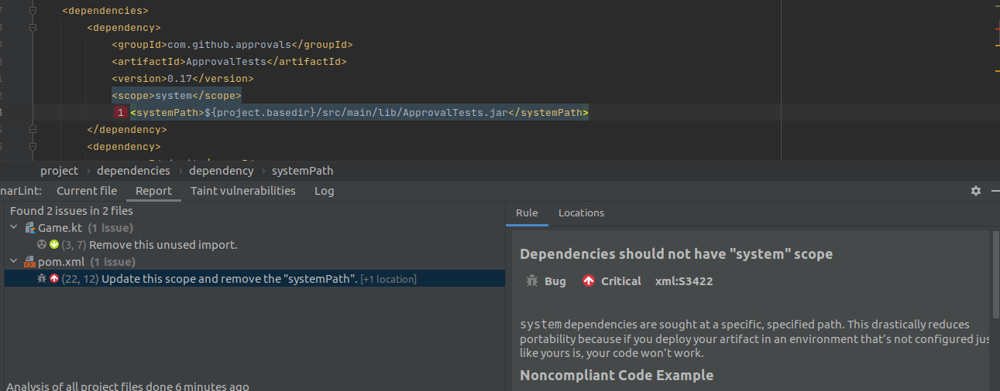

# BugsZero Kata

### Escuela colombiana de ingeniería Julio Garavito

### CSDT

## Proyecto

* Idioma seleccionado: **Kotlin**

**Temas:**

* [Revisión preliminar](CSDT_PrimeraEntrega2022.md)
* [Análisis del código](CSDT_PrimeraEntrega2022.md)
* [Análisis deuda técnica en las Pruebas](CSDT_PrimeraEntrega2022.md)
* [CI y herramientas de análisis de calidad](CI-GitHub.md)
* [Deuda en la arquitectura](CSDT_Architectural_debt.md)

---

## Deuda en la arquitectura

Para identificar las causas de los problemas de arquitectura que puedan haber en el proyecto es necesario preguntarnos
¿Quién es el equipo en involucrado? En este caso el proyecto es un Dojo de aprendizaje con algunos errores hechos a
propósito, por lo que podemos suponer que la mayoría de la deuda en la arquitectura es intencional.

El proyecto en sí tiene una funcionalidad sencilla por lo que no hay muchos drivers y restricciones de negocio, por lo
cual vamos a centrarlos en los problemas de arquitectura que se puedan identificar analizando el código.

* **Dependencias externas sin soporte:**
  Haciendo uso de herramientas de análisis de código como [Sonarlint](CSDT_PrimeraEntrega2022.md) configurado
  previamente, podemos identificar Architectural Smells en el archivo [pom.xml](kotlin/pom.xml), con una de las
  dependencias usadas en el proyecto _ApprovalTests_, la cual no se importa de Maven central u otro repositorio
  unificado dependencias, sino que el archivo [Jar](kotlin/src/main/lib/ApprovalTests.jar) se encuentra directamente en
  el proyecto y esto compromete la portabilidad del proyecto y es una
  dependencia [inestable](https://www.tusharma.in/smells/AUD.html).

  

* **Obsolescencia tecnológica:**
  Una de los cambios necesarios para poder correr el proyecto actualizar la version de Kotlin, ya que versiones menores
  a la 1.3 no son compatibles con el JDK 11, ni la última versión del plugin de compatibilidad Kotlin-JVM. La mayoría de
  librerías que se encontraban originalmente en el proyecto están desactualizadas, por
  ejemplo [JUnit 4.8.2](https://mvnrepository.com/artifact/junit/junit/4.8.2), tiene fecha lanzamiento octubre del 2010
  y presenta algunas vulnerabilidades de
  seguridad [CVE-2020-15250](https://cve.mitre.org/cgi-bin/cvename.cgi?name=CVE-2020-15250).

  Otro caso es _ApprovalTests_ de la cual no se sabe exactamente que versión se usa en el pom.xml indica la versión
  0.17, en [Maven central](https://mvnrepository.com/artifact/com.approvaltests/approvaltests) la versión actual es la
  15.0.0 la más antigua es la [2.0.0](https://mvnrepository.com/artifact/com.approvaltests/approvaltests/2.0.0) de 2018,
  que cuenta con multiples vulnerabilidades de seguridad
  como: [CVE-2022-23305](https://cve.mitre.org/cgi-bin/cvename.cgi?name=CVE-2022-23305),
  [CVE-2022-23302](https://cve.mitre.org/cgi-bin/cvename.cgi?name=CVE-2022-23302) entre otras.

* **Problemas explicitos en el código:**
  En el compone de código que se encarga de la lógica del proyecto también podemos encontrar deuda técnica en
  arquitectura, algunos de estos puntos se explican previamente en más detalle
  en [secciones](CSDT_PrimeraEntrega2022.md) anteriores, pero por ejemplo el uso de constantes mágicas y los problemas
  de acoplamiento de la cantidad de jugadores en el juego, afectan el atributo de calidad de modificabilidad del
  proyecto.

  El proyecto no cuenta con capas que podrían separa la vista (UI) y la lógica, están integrados los _prints_ en los
  métodos del funcionamiento del juego [No layer](https://www.tusharma.in/smells/NL.html).

* **Diseños no actualizados o no existentes:**
  No existe diseños ni documentación de la arquitectura del proyecto, para trabajar de forma efectiva como un equipo es
  necesario ser capaz de expresar el funcionamiento de la arquitectura de forma rápida entre el equipo, en esto juega un
  rol importante los diagramas y otras forma de documentación, que nos permiten visualizar y documentar los artefactos y
  sus interacciones en un sistema de software, facilitando así la comunicación de ideas.

## Autor

* **[Sergio Rodríguez](https://github.com/SergioRt1)**

## License

This project is license under the Apache-2.0 License - see the [LICENSE](LICENSE) file for more details.
