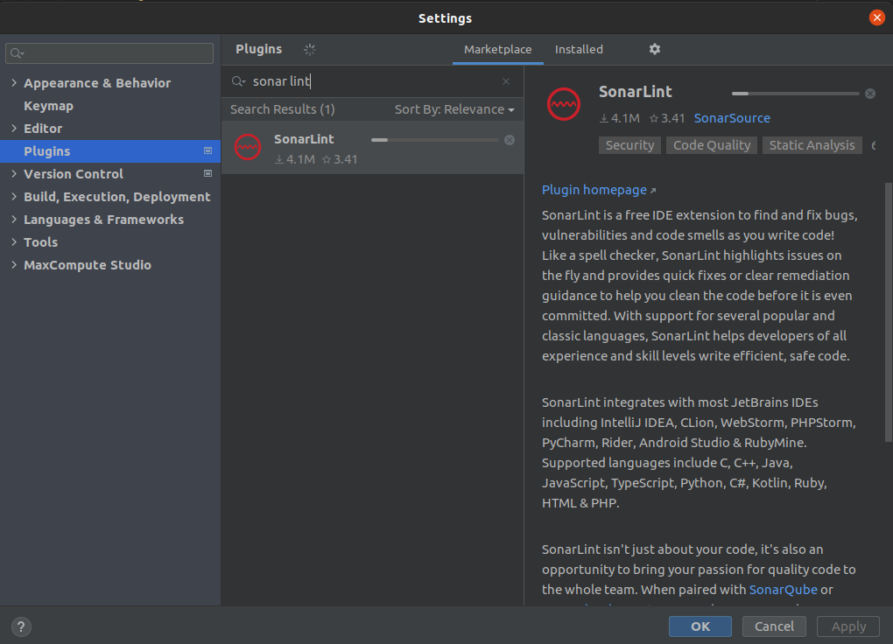

# BugsZero Kata

### Escuela colombiana de ingeniería Julio Garavito

### CSDT

## Proyecto

* Idioma seleccionado: **Kotlin**

**Temas:**

* Revisión preliminar
* Análisis del código
* Análisis deuda técnica en las Pruebas
* CI y herramientas de análisis de calidad

---

## Revisión preliminar

### Code smells y problemas detectados

* __Código duplicado:__ En varios métodos se repite código como:
  ``` kotlin
  if (currentPlayer == players.size) currentPlayer = 0
  ``` 
* __Código dificil de testear:__ Es dificil de aislar las pruebas validando una sola funcionalidad, la UI y la lógica
  están mezcladas, y hay métodos que realizan más de una funcionalidad y llaman a otros métodos privados que son
  difíciles de probar de forma individual, como `roll` llama `movePlayerAndAskQuestion` que a su ves llama
  a `askQuestion` que llama a `currentCategory`.

* Acceso a indices de arreglos sin validar, generando posibles _Index out of bounds exception_.
  ``` kotlin
  fun MutableList<String>.removeFirst(): String {
    return this.removeAt(0)
  }
  ```
* Variables definidas como mutables cuando pueden ser inmutables `val` y definirse en el constructor
  ``` kotlin
  var players = mutableListOf<String>()
  ```

* El constructor no se usa para inicializar los parámetros de la clase, se usan los valores default
  ``` kotlin
  var players = mutableListOf<String>()
  var places = IntArray(6)
  var purses = IntArray(6)
  var inPenaltyBox = BooleanArray(6)
  ```

* Acoplamiento de la cantidad de jugadores: Del bloque de código anterior se ve que el número de jugadores está
  explícito en el código _(6)_ como un literal sin valor semántico, estas variables se pueden inicializar en el
  constructor.
* Poca cohesión entre la lógica y los datos

### Técnicas de refactor identificadas

* Extract Method
* Extract variable
* Encapsulate Record
* Change Function Declaration
* Inline Function
* Replace Magic Literal
* Remove Flag Argument

---

## Análisis del código

### Características Clean code

* __Código enfocado:__ No hay métodos excesivamente largos, sin embargo se puede mejorar hay métodos tiene varias
  responsabilidades, por
  ejemplo [movePlayerAndAskQuestion](kotlin/src/main/kotlin/com/adaptionsoft/games/uglytrivia/Game.kt) hace dos cosas
  mueve al jugador y realiza una pregunta, esto se puede separar.
  ``` kotlin
  private fun movePlayerAndAskQuestion(roll: Int) {
    places[currentPlayer] = places[currentPlayer] + roll
    if (places[currentPlayer] > 11) places[currentPlayer] = places[currentPlayer] - 12

    println(players.get(currentPlayer)
            + "'s new location is "
            + places[currentPlayer])
    println("The category is " + currentCategory())
    askQuestion()
  }
  ```

* __Regla del Boy Scout:__ Esta característica aplica en el historial de Git se observan cambios al código fuente y la
  documentación, correcciones de bugs y actualización de librerías ejemplo: commit `9dd55ac2`

* __Entendible:__ Esta característica se cumple en su mayoría, los nombres de variables y métodos tiene un sentido
  semántico, pero hay algunas literales mágicos como:
  ``` kotlin
  private fun didPlayerWin(): Boolean {
    return purses[currentPlayer] != 6
  }
  ```

* __Escalable:__ La aplicación no es muy escalable, por ejemplo agregar la funcionalidad para jugar de a más de dos
  jugadores requeire realizar multiples cambios porque parte de la logica está acoplada a 2 jugadores
   ``` kotlin
  val isPlayable: Boolean
    get() = howManyPlayers() >= 2
   ```
  Además hay muchas variables explicitas y codigo que se puede refactorizar siguendo los principios SOLID.
* __Duplicidad:__ Hay segmentos de código que se repiten en multiples métodos como:
  ``` kotlin
  if (currentPlayer == players.size) currentPlayer = 0
  ``` 
* __Abstracción:__ Se peude mejorar la abstracción hay metodos que hacen más d euna cosa y la logica y la paca de vista
  que interactuá con el usuario están muy acopladas, si se desea cambiar la UI no se puede reusar la logia del juego.
  ``` kotlin
  fun add(playerName: String): Boolean {
    players.add(playerName)
    places[howManyPlayers()] = 0
    purses[howManyPlayers()] = 0
    inPenaltyBox[howManyPlayers()] = false

    println(playerName + " was added")
    println("They are player number " + players.size)
    return true
  }
  ```
* __Testeable:__  No es sencillo de testiear, al menos con pruebas unitarias aisladas que validen cada método.
* __Principio menor asombro:__ Este principio se cumple los métodos hacen los su nombre índica.

### Principios de programación

* __YAGNI:__ Este principio se cumple, no hay funcionalidades o métodos sin usar
* __KISS:__ El proyecto es corto y por ende tiene poca complejidad, sin embargo hay métodos innecesarios como:
  ``` kotlin
  fun MutableList<String>.addLast(element: String) {
    this.add(element)
  }
  ```

* __DRY:__ Hay segmentos de código repetidos en varias partes del código como:
  ``` kotlin
  if (currentPlayer == players.size) currentPlayer = 0
  ``` 
* __SOLID:__ se pueden aplicar varias mejoras siguiendo los principios SOLID, como ya se ha mencionado anteriormente,
  por ejemplo refactorizar lo acoplado que se encuentra que el juego solo sea para dos jugadores o como la UI y la
  logica están juntas permitiría mejorar el principio Open/Close

### Practicas XP

Podrían utilizarse:

* __Refactoring:__ Se pueden aplicar tecnicas de refactoring para extraer variables, métodos, darle significado
  semántico a algunos literales mágicos
  ``` kotlin
  private fun currentCategory(): String {
    if (places[currentPlayer] == 0) return "Pop"
    if (places[currentPlayer] == 4) return "Pop"
    if (places[currentPlayer] == 8) return "Pop"
    if (places[currentPlayer] == 1) return "Science"
    if (places[currentPlayer] == 5) return "Science"
    if (places[currentPlayer] == 9) return "Science"
    if (places[currentPlayer] == 2) return "Sports"
    if (places[currentPlayer] == 6) return "Sports"
    return if (places[currentPlayer] == 10) "Sports" else "Rock"
  }
  ``` 
  Además la logica y capa de la vista que interactúa con el usuario están muy acopladas.

* __Continuous integration:__ El proyecto no cuenta con CI.
* __Simple design:__ Se puede refactorizar la app, en un diseño más sencillo menos acoplado y extensible.
* __Test-driven development:__ Se puede aplicar esta práctica para construir una aplicación fácil de testear y menos
  acoplada.

---

## Análisis deuda técnica en las Pruebas

### Prácticas de Testing debt

* **Son pruebas unitarias no de integración:** No se implementan pruebas unitarias, hay una sola prueba en el proyecto y
  válida toda la funcionalidad en diversos casos, se podrían considerar pruebas de usuario final.
* Las pruebas están muy acopladas al estado actual del proyecto, si se agregan nuevas funcionalidades se debera cambiar
  el
  archivo [GameTest.itsLockedDown.approved.txt](kotlin/src/test/kotlin/com/adaptionsoft/games/trivia/GameRunnerTest.itsLockedDown.approved.txt)
  que contiene todos los escenarios que son válidos.
* Promover un cubrimiento alto: Las pruebas se cubre casi todo el código (96% líneas), el único método que no se prueba
  es:
  ```kotlin
    val isPlayable: Boolean
        get() = howManyPlayers() >= 2
  ```
  porque es un método que no se usa, aun así se podría realizar una prueba unitaria para validar su funcionamiento.
* No se usa el patrón AAA
* No se cumple _Divide y vencerás. Foco en un escenario a la vez_ se corre un
  único [test](kotlin/src/test/kotlin/com/adaptionsoft/games/trivia/GameTest.kt) que cubre varios escenarios.
* **Utilice estándares de nombramiento y prácticas de Clean Code:** El nombre del test no es `itsLockedDown` muy
  semántico de lo que se desea validar.
* **Nuevos defectos nuevas pruebas unitarias**: Como está si se detecta un defecto se modificaría el
  archivo [GameTest.itsLockedDown.approved.txt](kotlin/src/test/kotlin/com/adaptionsoft/games/trivia/GameRunnerTest.itsLockedDown.approved.txt)
  que contiene los resultados esperados, no se realizaría una nueva prueba unitaria.

## Pruebas unitarias

Se Agregaron nuevas pruebas unitarias para la clase `Game` en el
archivo [GameTest.kt](kotlin/src/test/kotlin/com/adaptionsoft/games/ugltrivia/GameTest.kt) que se encuentra en el mismo
paquete de la clase aprobar y se renombró el test original
a [GameRunnerTest](kotlin/src/test/kotlin/com/adaptionsoft/games/trivia/GameRunnerTest.kt)

Para garantizar que no hayan dependencias entre pruebas se agregaron bloques `@Before` y `@After` para limpiar la
ejecución de cada caso

```kotlin
private lateinit var out: PrintStream

@Before
fun setUp() {
    out = System.out
}

@After
fun tearDown() {
    System.setOut(out)
}
```

Cada test tiene el buffer de salida default, por lo que si se valida el output sobreescribiendo el buffer no va a
afectar a otras pruebas, esto es util para pruebas como `roll message should work` y `add player message should work`
entre otras que validan el output de la consola.

## Sugerencias

* Se debería refactorizar el código para reducir las dependencias entre métodos, por ejemplo hay métodos que realizan
  multiples acciones y llaman a otros métodos privados que son difíciles de probar de forma individual, como `roll`
  llama `movePlayerAndAskQuestion` que a su ves llama a `askQuestion` que llama a `currentCategory`.
* Separar la capa de UI y de lógica, se deben hacer pruebas que cubran ambas funcionalidades sobre el mismo método, por
  ejemplo las pruebas `add player message should work` y `add player should work`, este acoplamiento dificulta las
  pruebas y la extensibilidad de la aplicación.

---

## CI y herramientas de análisis de calidad

### SonarCloud

Para configurar SonarCloud debemos conceder permisos para acceder al repositorio Git, luego establecer en el repositorio
un _secret_ en la configuración de GitHub Actions con el token de Sonar, por último debemos agregar el archivo de
[build.yml](.github/workflows/build.yml) para el pipeline en Github Actions y agregar las properties de sonar a la de
Maven en el [pom.xml](kotlin/pom.xml).

Estos cambios se pueden ver en el
commit [3aa238a](https://github.com/SergioRt1/BugsZero-Kata/commit/3aa238a3710a7dfe305d479010f3de8403a349cd).


### Cobertura con JaCoCo

La cobertura de código es el porcentaje de código que está cubierto por pruebas automatizadas. La medición de cobertura
de código determina declaraciones en el código se han ejecutado a través de la ejecución de pruebas y qué declaraciones
no.

SonarCloud nos permite llevar un historial de las métricas de calidad del código de nuestro proyecto, pero no se encarga
de hacer el análisis de cobertura, usa el informe generado por herramientas externas para seguir la cobertura.

En este caso se usará [JaCoCo](https://github.com/jacoco/jacoco), una de las herramientas más populares para realizar el
análisis de cobertura en la JVM, el proceso para configurar la herramienta se puede encontrar en
la [documentación](https://docs.sonarcloud.io/enriching/test-coverage/java-test-coverage/), modificamos
el [pom.xml](kotlin/pom.xml) para incluir el plugin de JaCoCo, estos cambios lo podemos ver en el
commit [47ab1d8](https://github.com/SergioRt1/BugsZero-Kata/commit/47ab1d86c98062929db639ee6285a6897b3de69b).


### SonarLint

SonarLint es una herramienta que permite realizar análisis de código de forma local en el IDE para identificar y
corregir problemas de calidad y seguridad en el código de forma temprana.

Para instalar la herramienta solo debemos ir al IDE y agregar el _plugin_



En la nueva pestaña de SonarLint podemos correr un análisis sobre el proyecto para identificar los problemas de forma
local, estos errores son lso mismos que vemos en SonarCloud.


### Análisis del proyecto

Con las herramientas de análisis de código podemos detectar algunos problemas y llevar trazabilidad de la evolución del
proyecto, la cobertura de los test (97%~) es amplia debido a
los [test](kotlin/src/test/kotlin/com/adaptionsoft/games/ugltrivia/GameTest.kt) unitarios agregados, además el proyecto
no es muy extenso y no hay demasiados problemas que sean evidentes.  

## Autor

* **[Sergio Rodríguez](https://github.com/SergioRt1)**

## License

This project is license under the Apache-2.0 License - see the [LICENSE](LICENSE) file for more details.
